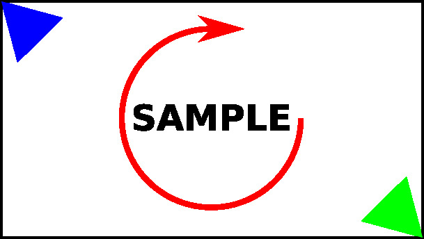
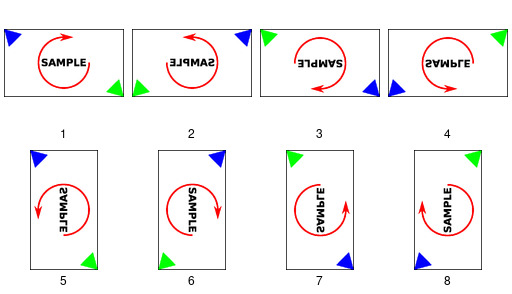
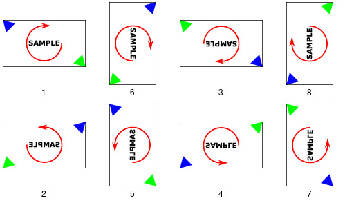

# EXIF orientations

JPEG images can be rotated (and mirrored) without having to reencode raster data, and thus without incurring additional quality loss, simply using EXIF tags.

Starting from this image:

`Exif.Image.Orientation` values 1 - 8:

In the following table, angles are in degrees, counterclockwise.

| `Exif.Image.Orientation` | Angle | Mirrored |
|--------------------------|-------|----------|
| 1                        | 0     |          |
| 2                        | 0     | yes      |
| 3                        | 180   |          |
| 4                        | 180   | yes      |
| 5                        | 270   | yes      |
| 6                        | 270   |          |
| 7                        | 90    | yes      |
| 8                        | 90    |          |
